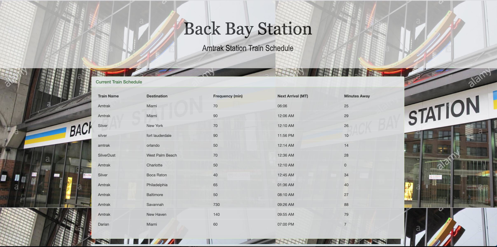
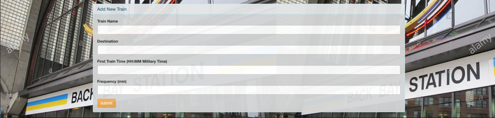

# Firebase-Train Scheduler (Basic) #

A train schedule application that incorporates Firebase to host arrival and departure data.

https://leopard-2019.github.io/Train-Scheduler/

This app  incorporates Firebase to host arrival and departure data. 

This app retrieves and manipulates this information with Moment.js. The website provides up-to-date information 
about various trains, namely their arrival times and how many minutes remain until they arrive at their station.

The app suits these basic specs:
  
  * When adding trains, administrators should be able to submit the following:
    
    * Train Name
    
    * Destination 
    
    * First Train Time -- in military time
    
    * Frequency -- in minutes
  
  * The app estimates when the next train will arrive; and it is relative to the current time.
  
  * Users from many different machines must be able to view same train times.
